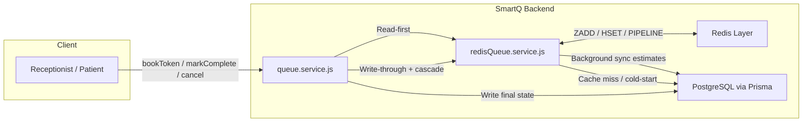

# SmartQ — Redis Integration Plan
## Real-Time Queue Layer with PostgreSQL as Persistence Backbone

---

## Background

Currently, every queue mutation (Complete, Cancel) triggers **N individual PostgreSQL UPDATE** calls in a loop — one per downstream token. `getPatientView` fires **4 separate DB queries** per patient request. At peak load (10s of simultaneous patients refreshing their view), this creates significant I/O pressure and latency.

The fix: **offload the live queue computation to Redis** (in-memory, sub-millisecond), and let PostgreSQL focus on what it's built for — durable, final-state persistence.

---

## Architecture Overview



**The golden rule:**
- **PostgreSQL** = write once per terminal event (COMPLETED, CANCELLED), immutable history
- **Redis** = live queue state, estimated times, cascade compute — ephemeral, in-memory, fast

---

## Redis Data Structures (Key Schema)

This is the most critical design decision. We use three Redis data types, each chosen for a specific access pattern.

| Key Pattern | Type | Score / Fields | Purpose |
|---|---|---|---|
| `queue:active:{doctorId}:{YYYY-MM-DD}` | **Sorted Set (ZSET)** | Score = `tokenNumber` | Ordered list of active token IDs. Enables O(log N) insert/remove, O(1) rank lookup |
| `token:{tokenId}` | **Hash** | 12 fields (status, times, phone...) | Per-token state. Only live fields needed for queue display and cascade |
| `serving:{doctorId}:{YYYY-MM-DD}` | **String** | `tokenNumber` value | Which token is currently IN_PROGRESS. Single-key O(1) read |

### Why Sorted Set for Queue Ordering?

A **ZSET** stores members in ascending score order. Using `tokenNumber` as the score means:
- `ZADD` → add new token in correct position, O(log N)
- `ZREM` → remove completed/cancelled token, O(log N)
- `ZRANGE 0 -1` → get all token IDs in queue order, O(N)
- `ZRANK tokenId` → get position (= patientsAhead count), O(log N)

This replaces the entire `ORDER BY tokenNumber` DB pattern with an in-memory operation.

### Hash Fields Stored Per Token

```
token:{tokenId}
├── tokenNumber          → "3"
├── status               → "WAITING" | "IN_PROGRESS"
├── estimatedStartTime   → ISO string (updated on cascade)
├── estimatedEndTime     → ISO string (updated on cascade)
├── predictedDurationMinutes → "14.5" (needed for cascade math)
├── patientsAhead        → "2"  (updated on cascade)
├── patientName          → "Ramesh Kumar"
├── patientPhone         → "9876543210"
├── visitType            → "NEW"
├── doctorProfileId      → UUID
└── appointmentDate      → "2026-04-01"
```

> [!NOTE]
> We deliberately store **only 11 fields** in Redis — not the full 30+ column DB row. The ML feature inputs, historical analytics, and notification flags live only in PostgreSQL. This keeps Redis memory lean.

**TTL Strategy**: Both the ZSET key and each token hash expire via `EXPIREAT` set to **midnight of the `appointmentDate` + 6 hours**. Automatic cleanup with zero maintenance required.

---

## Operation Flow: Before vs After

### bookToken

| Phase | Before (DB only) | After (DB + Redis) |
|---|---|---|
| 1 | `FOR UPDATE` row lock, get lastToken | Same — DB is still source of truth for sequencing |
| 2 | `CREATE` token in DB | Same |
| 3 | Return response | **Push token to Redis** (ZADD + HMSET + EXPIREAT) |
| **Risk** | N/A | Redis push failure is fire-and-forget (warns, doesn't break booking) |

### cancelQueueService (biggest win)

| Phase | Before (DB only) | After (DB + Redis) |
|---|---|---|
| 1 | `UPDATE` token → CANCELLED | Same (final state to DB) |
| 2 | `findMany` all later WAITING tokens (1 DB read) | `ZREM` from sorted set |
| 3 | **Loop: N individual `UPDATE` calls** | **`recomputeCascade()` in-memory via pipeline** |
| 4 | *(nothing)* | Background `prisma.updateMany()` to sync new estimates to DB |
| **DB writes** | **N+1** | **1 + async** |

### getPatientViewService (highest read frequency)

| Phase | Before (4 DB queries) | After (Redis-first) |
|---|---|---|
| 1 | `findUnique` token + doctor join | `HGETALL token:{tokenId}` |
| 2 | `findFirst` IN_PROGRESS token | `GET serving:{doctorId}:{date}` |
| 3 | `count` WAITING tokens ahead | Read `patientsAhead` from Hash (stored during cascade) |
| 4 | `findMany` predicted durations ahead, reduce | Sum `predictedDurationMinutes` from `ZRANGE` prefix |
| **DB round-trips** | **4** | **0 (cache hit) / 4 (fallback)** |

---

## Files to Create / Modify

### [NEW] `src/config/redis.js`

Initialize an `ioredis` client with production-grade retry logic and event logging.

```js
import Redis from 'ioredis';
import logger from '../utils/logger.js';

const redis = new Redis(process.env.REDIS_URL ?? 'redis://localhost:6379', {
  maxRetriesPerRequest: 3,
  retryStrategy(times) {
    if (times > 5) {
      logger.error('[Redis] Max connection retries exceeded');
      return null; // stop retrying, let it fail gracefully
    }
    const delay = Math.min(times * 100, 2000); // exponential backoff, cap at 2s
    logger.warn(`[Redis] Retrying connection in ${delay}ms (attempt ${times})`);
    return delay;
  },
});

redis.on('connect', () => logger.info('[Redis] Connected successfully'));
redis.on('error',   (err) => logger.error(`[Redis] ${err.message}`));
redis.on('close',   () => logger.warn('[Redis] Connection closed'));

export default redis;
```

> [!NOTE]
> `ioredis` automatically queues commands during reconnect. Your other services won't crash if Redis briefly drops — they'll queue and flush when it comes back.

---

### [NEW] `src/services/redisQueue.service.js`

This is the new Redis abstraction layer. All Redis operations go here. `queue.service.js` never touches Redis directly.

**Key helpers:**
```js
// Key generators
const queueKey  = (docId, date) => `queue:active:${docId}:${date}`;
const tokenKey  = (tokenId)     => `token:${tokenId}`;
const servingKey = (docId, date) => `serving:${docId}:${date}`;

// TTL: midnight of the appointmentDate + 6hr buffer
function getExpireAt(dateStr) {
  const d = new Date(`${dateStr}T00:00:00.000Z`);
  d.setUTCDate(d.getUTCDate() + 1);
  d.setUTCHours(6, 0, 0, 0); // 06:00 UTC next day
  return Math.floor(d.getTime() / 1000); // Unix timestamp for EXPIREAT
}
```

**Core functions to implement:**

```
pushToken(token)
  → ZADD queueKey token.tokenNumber token.id
  → HMSET tokenKey {...fields}
  → EXPIREAT both keys

removeToken(doctorId, date, tokenId)
  → ZREM queueKey tokenId
  → DEL tokenKey

setServing(doctorId, date, tokenNumber)
  → SET servingKey tokenNumber
  → EXPIREAT servingKey

clearServing(doctorId, date)
  → DEL servingKey

getLiveQueue(doctorId, date)
  → ZRANGE queueKey 0 -1  (get all tokenIds in order)
  → pipeline: HGETALL for each tokenId  (single round-trip)
  → return parsed array

getTokenData(tokenId)
  → HGETALL tokenKey
  → parse and return

recomputeCascade(doctorId, date, fromTime)  ← THE CORE FUNCTION
  → ZRANGE queueKey 0 -1
  → for each tokenId:
      HGETALL tokenKey
      compute newStart, newEnd
      pipeline.HMSET tokenKey { estimatedStartTime, estimatedEndTime, patientsAhead }
  → pipeline.exec()  ← single Redis round-trip for all updates
  → syncEstimatesToDB(updates)  ← fire-and-forget background write

hydrateFromDB(doctorId, date)  ← cold-start recovery
  → prisma.queue.findMany({ WAITING | IN_PROGRESS })
  → pipeline: ZADD + HMSET + EXPIREAT for each token
  → pipeline.exec()

syncEstimatesToDB(updates)  ← background, non-blocking
  → prisma.$transaction(updates.map(u => tx.queue.update(...)))
  → .catch(err => logger.warn('[Redis] DB sync failed:', err.message))
```

> [!IMPORTANT]
> `recomputeCascade` uses `pipeline.exec()` — this sends ALL Redis commands in a **single TCP packet**. Without pipelines, N token updates = N network round-trips to Redis. With pipeline = 1. This is one of the most important Redis performance patterns.

---

### [MODIFY] `src/services/queue.service.js`

Integrate Redis into existing functions. The changes are **additive** — existing DB logic is preserved as the authoritative write path.

**`bookTokenService`** (after the transaction commits):
```js
// Fire-and-forget Redis push (booking must not fail due to Redis)
pushToken({ id: token.id, tokenNumber: nextTokenNumber, status: 'WAITING',
             estimatedStartTime, estimatedEndTime, predictedDurationMinutes: resolvedDuration,
             patientName, patientPhone, visitType: visitType.toUpperCase(),
             doctorProfileId: doctor.id, appointmentDate, patientsAhead })
  .catch(err => logger.warn('[Redis] pushToken failed:', err.message));
```

**`markInProgressService`** (after DB update):
```js
redis.hmset(tokenKey(tokenId), { status: 'IN_PROGRESS', actualStartTime: new Date().toISOString() })
  .catch(err => logger.warn('[Redis] markInProgress update failed:', err.message));
setServing(token.doctorProfileId, token.appointmentDate, token.tokenNumber)
  .catch(err => logger.warn('[Redis] setServing failed:', err.message));
```

**`markCompleteService`** (after DB transaction):
```js
await removeToken(token.doctorProfileId, token.appointmentDate, tokenId)
  .catch(err => logger.warn('[Redis] removeToken failed:', err.message));
await clearServing(token.doctorProfileId, token.appointmentDate)
  .catch(err => logger.warn('[Redis] clearServing failed:', err.message));
await recomputeCascade(token.doctorProfileId, token.appointmentDate, token.estimatedEndTime)
  .catch(err => logger.warn('[Redis] cascade failed:', err.message));
```

**`cancelQueueService`** (replace the N-update loop):
```js
// Replace the entire for-loop (lines 491-506) with:
await prisma.queue.update({ where: { id: tokenId }, data: { status: 'CANCELLED' } });

await removeToken(token.doctorProfileId, token.appointmentDate, tokenId)
  .catch(err => logger.warn('[Redis] removeToken failed:', err.message));
await recomputeCascade(token.doctorProfileId, token.appointmentDate, token.estimatedStartTime)
  .catch(err => logger.warn('[Redis] cascade failed:', err.message));
```

**`getQueueService`** (Redis-first with hydration):
```js
export async function getQueueService(doctorId, date) {
  try {
    let queue = await getLiveQueue(doctorId, date);

    if (queue.length === 0) {
      // Potential cold-start: check if DB has active tokens we should serve from Redis
      const count = await prisma.queue.count({
        where: { doctorProfileId: doctorId, appointmentDate: new Date(date),
                 status: { in: ['WAITING', 'IN_PROGRESS'] } }
      });
      if (count > 0) {
        await hydrateFromDB(doctorId, date);
        queue = await getLiveQueue(doctorId, date);
      }
    }
    return queue;
  } catch (err) {
    logger.warn(`[Redis] getQueue fell back to DB: ${err.message}`);
    return prisma.queue.findMany({ /* existing query */ });
  }
}
```

**`getPatientViewService`** (4 DB queries → Redis lookups):
```js
// Try Redis first
const tokenData  = await getTokenData(tokenId);
const servingNum = await redis.get(servingKey(token.doctorProfileId, token.appointmentDate));
// patientsAhead is stored in hash, updated during cascade
// falls back to DB if tokenData is null
```

---

### [MODIFY] `package.json`
```
"ioredis": "^5.3.2"
```

### [MODIFY] `.env`
```
REDIS_URL=redis://localhost:6379
```

---

## Zero Schema Migration Required

> [!IMPORTANT]
> The `schema.prisma` file **does not change**. `estimatedStartTime` and `estimatedEndTime` remain in PostgreSQL — they are synced back after cascade via background `updateMany`. If Redis is wiped, `hydrateFromDB()` reconstructs the live queue on the next read. The system is fully recoverable from PostgreSQL alone.

---

## Resilience Story (Graceful Degradation)

| Scenario | What Happens |
|---|---|
| Redis is down | Reads fall back to DB. Writes skip Redis with a `warn` log. System runs as it did before. |
| Redis restarts (memory wiped) | First `getQueueService` call detects empty ZSET, calls `hydrateFromDB()`. Cache is warm again within milliseconds. |
| Background DB sync fails | Tokens show correct estimated times in Redis until the day expires. On next restart, DB data (slightly stale) is hydrated. Acceptable trade-off. |

---

## Interview Talking Points

When explaining this in an interview context:

1. **"Why Sorted Sets?"** → Sorted Sets give us O(log N) ordered insertion/deletion and O(log N) rank lookup. This is exactly the right structure for a priority queue where order matters and we need to quickly compute position.

2. **"What is a pipeline and why does it matter?"** → A Redis pipeline batches multiple commands and sends them in a single TCP round-trip. Without it, updating 10 tokens' estimated times = 10 network calls. With it = 1. At scale, this is the difference between 100ms and 5ms.

3. **"How do you handle Redis going down?"** → All Redis write operations are fire-and-forget with `catch` logging. Reads have explicit try/catch with DB fallback. The system degrades gracefully — it's slower but functional.

4. **"What is write-through caching?"** → We write to DB first (authoritative), then update Redis. This ensures Redis and DB stay in sync without complex invalidation logic.

5. **"What is cache warm-up / hydration?"** → When Redis starts cold, it has no data. `hydrateFromDB()` detects a cache miss on the first live queue read and populates Redis from PostgreSQL. The system self-heals.

---

## Implementation Order

```
Step 1: Install ioredis, add REDIS_URL to .env
Step 2: Create src/config/redis.js
Step 3: Create src/services/redisQueue.service.js (pushToken, removeToken, getLiveQueue, recomputeCascade, hydrateFromDB, syncEstimatesToDB)
Step 4: Modify queue.service.js — integrate Redis into bookToken, markInProgress, markComplete, cancelQueue
Step 5: Modify getQueueService (Redis-first)
Step 6: Modify getPatientViewService (Redis-first)
Step 7: Test: book 3 tokens → verify ZSET + hashes in Redis → call markComplete → verify cascade updated → verify DB synced
```

No migration. No downtime. Fully reversible — remove Redis integration and the system reverts to current behavior.


# SmartQ — Redis & Containerization Plan

This plan outlines the integration of Redis for high-performance queue management and the transition to a professional, containerized development environment using Docker Compose.

## User Review Required

> [!IMPORTANT]
> **Containerization Strategy**: We are moving to `docker-compose`. This means you will run the entire system (Backend, Postgres, Redis) via Docker.
> 
> [!WARNING]
> **Distributed State**: With this setup, your backend becomes "Stateless." Multiple replicas will share the same Redis instance, which is the industry standard for scalable systems.

## Proposed Changes

### 1. Infrastructure & Containerization [NEW]

#### [NEW] [docker-compose.yml](file:///c:/Users/ankit/Desktop/Repository/SmartQ%20-%20Hospital%20Queue%20Management/docker-compose.yml)
- Define `db` (Postgres), `redis`, and `backend` services.
- Configure inter-container networking.
- Map persistent volumes for Postgres and Redis data.

#### [NEW] [Dockerfile](file:///c:/Users/ankit/Desktop/Repository/SmartQ%20-%20Hospital%20Queue%20Management/backend/Dockerfile)
- Standard Node.js Alpine-based Dockerfile.
- Handle Prisma client generation during the build.

### 2. Redis Configuration

#### [MODIFY] [package.json](file:///c:/Users/ankit/Desktop/Repository/SmartQ%20-%20Hospital%20Queue%20Management/backend/package.json)
- Add `ioredis` dependency.

#### [NEW] [redis.js](file:///c:/Users/ankit/Desktop/Repository/SmartQ%20-%20Hospital%20Queue%20Management/backend/src/config/redis.js)
- Initialize `ioredis` with production-grade retry logic and logging.

### 3. Redis Queue Logic [NEW]

#### [NEW] [redisQueue.service.js](file:///c:/Users/ankit/Desktop/Repository/SmartQ%20-%20Hospital%20Queue%20Management/backend/src/services/redisQueue.service.js)
- **Data Structures**:
    - `Sorted Set`: For token ordering and rank lookups.
    - `Hashes`: For per-token metadata (status, times, etc.).
    - `String`: For tracking the current `IN_PROGRESS` token.
- **Core Operations**:
    - `pushToken`: Write-through to Redis.
    - `recomputeCascade`: In-memory time updates via Redis Pipelines.
    - `hydrateFromDB`: Cold-start recovery from Postgres.

### 4. Backend Integration

#### [MODIFY] [queue.service.js](file:///c:/Users/ankit/Desktop/Repository/SmartQ%20-%20Hospital%20Queue%20Management/backend/src/services/queue.service.js)
- Update `bookTokenService` to push to Redis.
- Update `markCompleteService` and `cancelQueueService` to trigger Redis cascade updates.
- Refactor `getQueueService` and `getPatientViewService` to be "Redis-first" with a Postgres fallback.

## Open Questions

- **Docker Networking**: Do you have a specific docker network name you prefer, or should I use the default compose bridge?
- **Retention**: Currently, I've set Redis keys to expire at midnight + 6 hours. Does this align with your hospital's operational cycle?

## Verification Plan

### Automated Verification
- **Compose Test**: Run `docker-compose up` and verify all services start and connect.
- **Redis Sync**: Book 5 tokens and verify they appear correctly in Redis using `redis-cli` (or a helper script).
- **Cascade Test**: Complete a token and verify subsequent tokens' estimated times update in Redis via logs.

### Manual Verification
- Verify the "Patient View" estimated wait time updates instantly when a doctor completes a consultation.
